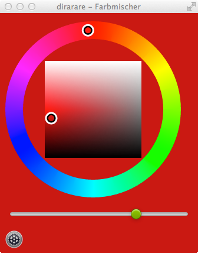
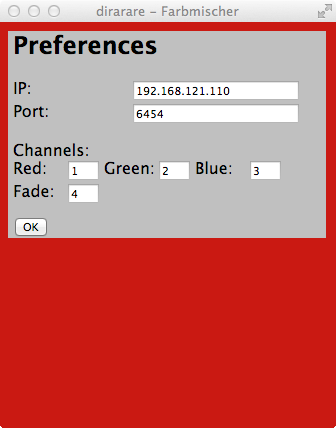

dirarare-farbmischer
====================

Mix color of one 3-channel rgb DMX light

Use my [Dirarare ArtNet Server](https://github.com/petershaw/dirarare-artnet-server) contributors are welcome.

## Screenshot ##





## Build ##

```bash
npm install
node_modules/bower/bin/bower install
npm start
```

